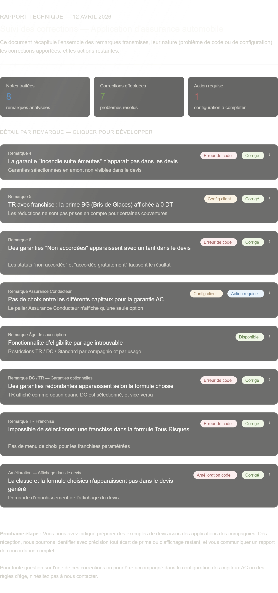

file:///C:/Users/LENOVO/Downloads/rapport_notes_corrections.html
*************************************************************
Objet: Port Forwarding - espaceclient.arstunisie.com

Bonjour,

HTTPS est maintenant configuré sur le serveur avec le certificat SSL.

Pour rendre l'application accessible publiquement, merci de configurer le port forwarding:

Source: 197.14.56.53:443
Destination: 192.168.100.10:443
Protocole: TCP

Cela permettra l'accès via: https://espaceclient.arstunisie.com

Merci!
